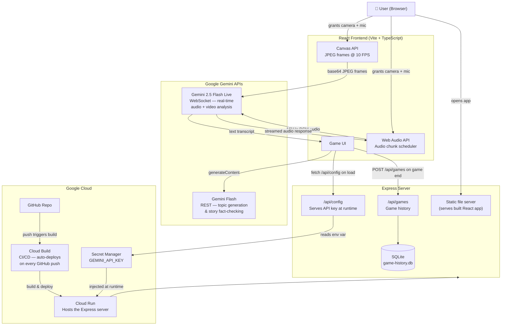

# Truth or Li(v)e

A multiplayer AI-powered lie detection game. Either you tell a story and the AI tries to catch you lying using live video and voice analysis, or the AI tells a story and you try to figure out if it's true or false.

## Architecture



## How the Gemini Models Are Used

| Model | Where | What it does |
|---|---|---|
| **Gemini 2.5 Flash Live** | Detective mode | Receives live webcam JPEG frames + microphone PCM audio simultaneously over a WebSocket. Watches facial expressions, listens to voice, asks questions, delivers a `VERDICT: TRUE/FALSE` |
| **Gemini 2.5 Flash Live** | Storyteller mode | Tells a true or false story in audio, responds to player questions in real time |
| **Gemini Flash** | Topic generation | Generates a unique scenario for the user to lie about before the game starts |
| **Gemini Flash** | Fact-check reveal | After a true story game, looks up the real historical event the AI described and returns a factual summary |

## Running Locally

**Prerequisites:** Node.js 18+

1. **Install dependencies:**
   ```bash
   npm install
   ```

2. **Create a `.env` file** in the project root with your Gemini API key:
   ```
   GEMINI_API_KEY=your_api_key_here
   ```
   Get a free API key at [Google AI Studio](https://aistudio.google.com/apikey).

3. **Start the dev server:**
   ```bash
   npm run dev
   ```
   Open [http://localhost:3000](http://localhost:3000) in your browser.

> **Note:** The game uses your camera and microphone. Make sure to allow access when prompted.

## Game Modes

- **I Tell a Story** — You tell the AI a true or made-up story. It watches your face and listens to your voice to decide if you're lying.
- **AI Tells a Story** — The AI tells a story about a random topic. You and your friends ask questions and vote on whether it's true or false.

## Deploying to Production

The app runs as an Express server that serves the built React frontend. Set the `GEMINI_API_KEY` environment variable on your hosting platform.

```bash
npm start   # builds the frontend then starts the server on $PORT (default 8080)
```
